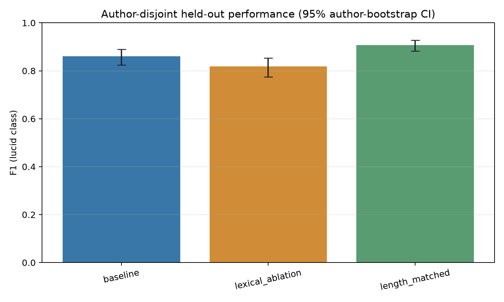

# LucidBench

**LucidBench — Computational Markers of Lucidity, Agency, Control, and Metacognition in Dream Reports**

LucidBench is an open computational dream-science research project. Its initial goal is to study whether lucid and non-lucid dreams exhibit reproducible computational and linguistic differences, with special attention to separating:

- lucidity / awareness of dreaming;
- agency;
- dream control;
- metacognition;
- waking-memory access;
- sensory and perceptual features; and
- emotional characteristics.

The project is intended to support reproducible research and, over time, collaboration with academic sleep and dream researchers. Lucidity is not treated as interchangeable with agency or dream control.

## Research questions

1. Can lucid vs. non-lucid dream reports be predicted above lexical baselines when evaluation is held out by dreamer?
2. Which linguistic features are associated with lucidity after controlling for author leakage, report length, and explicit label vocabulary?
3. Are awareness, agency, control, metacognition, waking-memory access, sensory/perceptual features, and emotional characteristics empirically separable?
4. How well do models generalize to unseen dreamers and, eventually, independently collected laboratory reports?

## Scope of v0.1

- Download and inspect the public DreamViews-derived corpus.
- Normalize lucid/non-lucid labels and use dreamer/author-disjoint evaluation whenever user IDs are available.
- Train a TF-IDF + logistic-regression classification baseline.
- Produce classification metrics, model coefficients, and exploratory rule-based dimension scores.

The rule-based scores are exploratory indicators, not validated measurements or human annotations. The v0.1 classifier and associated evaluation scripts are research baselines, not evidence that any particular linguistic marker is a validated finding.

## Data

Primary dataset:

- Remington Mallett (2026), **A large corpus of lucid and non-lucid dream reports**.
- Zenodo record: https://zenodo.org/records/19161757
- Paper: https://arxiv.org/abs/2603.26992
- Original software repository: https://github.com/remrama/dreamviews

Dataset files are not committed to this repository. Download them locally with the script below. The Zenodo record identifies the corpus as **CC BY-NC 4.0**; review those terms and ethical considerations before use. The code is MIT-licensed, but the source dataset and the dataset-derived coefficient tables in `results/v0.2/` are not.

## Quickstart

```bash
python3 -m venv .venv
source .venv/bin/activate
python -m pip install -e ".[dev]"
python scripts/download_data.py
python scripts/inspect_data.py
python -m lucidbench.experiments --config configs/v0.2.yaml
python -m lucidbench.train_baseline --config configs/baseline.yaml
```

Run tests:

```bash
python -m pytest
```

## Methodology

**Dreamer/author-disjoint splitting is required for LucidBench's main experiments.** All reports from an identified dreamer must remain on one side of a train/test split, preventing the model from benefiting from the same person's writing style in both sets. The v0.2 experiment now fails if author IDs are missing or incomplete. Exploratory report-level splitting requires the explicit `--allow-report-level-split` option and is labeled leakage-sensitive.

Future analyses include:

- user-balanced sampling;
- repeated author-group splits; and
- human-validated phenomenology and external laboratory evaluation.

The v0.2 baseline, lexical ablation, length-matched sensitivity analysis, and author-bootstrap intervals are documented below and in [`docs/RESEARCH_PROTOCOL.md`](docs/RESEARCH_PROTOCOL.md).

See [`docs/RESEARCH_PROTOCOL.md`](docs/RESEARCH_PROTOCOL.md) for the planned protocol and threats to validity.

## Planned phenomenology schema

| Dimension | Operational question |
|---|---|
| Awareness | Does the dreamer explicitly recognize the experience as a dream? |
| Agency | Does the dreamer intentionally choose actions? |
| Control | Does the dreamer deliberately alter dream content or the environment? |
| Metacognition | Does the dreamer reason about their own mental state or dream state? |
| Waking-memory access | Does the dreamer access information or intentions from waking life? |
| Sensory/perceptual features | Which sensory modalities and perceptual qualities are reported? |
| Emotional characteristics | Which emotions are reported, and how are they characterized? |
| Stability | Does awareness/control appear to affect continuation, fading, or termination? |

See [`docs/ANNOTATION_RUBRIC.md`](docs/ANNOTATION_RUBRIC.md). The rubric is a proposed annotation framework; its dimensions require human validation before being treated as validated measures.

## Repository structure

```text
lucidbench/
├── configs/              # experiment configuration
├── data/                 # ignored raw/processed datasets
├── docs/                 # research protocol, rubric, literature notes
├── notebooks/            # exploratory notebook guidance
├── results/              # committed aggregate v0.2 results; other outputs ignored
├── scripts/              # data utilities
├── src/lucidbench/       # reusable package
└── tests/                # unit tests
```

## v0.2 Results

The first corpus-backed baseline was run on Remington Mallett's *A large corpus of lucid and non-lucid dream reports* (Zenodo [10.5281/zenodo.19161757](https://doi.org/10.5281/zenodo.19161757), CC BY-NC 4.0). Its 57,778 rows contain 10,231 `lucid`, 27,830 `nonlucid`, 15,606 `unspecified`, and 4,111 `ambiguous` labels. The binary experiment includes only the first two categories (38,061 reports) and excludes the other 19,717. The full corpus has 5,036 authors; the labeled subset has 3,689. The schema, missingness, report-length, and reports-per-author summaries are in [`dataset_summary.json`](results/v0.2/dataset_summary.json).

With seed 42, an 80/20 `GroupShuffleSplit` by `user_id` produced 30,710 training and 7,351 test reports; all 738 test authors were absent from training. TF-IDF used 1–2 grams (`min_df=3`, up to 50,000 features) and class-weighted logistic regression (`C=1`). Intervals are 95% percentile intervals from 1,000 cluster-bootstrap resamples of held-out authors.

| Experiment | Accuracy | Balanced accuracy | Precision | Recall | F1 (95% author-bootstrap CI) | ROC-AUC |
|---|---:|---:|---:|---:|---:|---:|
| Baseline | 0.930 | 0.915 | 0.834 | 0.888 | 0.860 (0.824–0.890) | 0.972 |
| Lexical ablation | 0.908 | 0.888 | 0.790 | 0.849 | 0.819 (0.775–0.853) | 0.957 |
| Length-matched sensitivity | 0.909 | 0.909 | 0.924 | 0.893 | 0.908 (0.882–0.928) | 0.969 |

The ablation removes configured whole-word cues (`lucid`, `dream` and inflections, `realize`/`realise` forms, `wake`/`woke` forms, `reality`, `real`, plus the lucid-dream abbreviations `LD`, `DILD`, and `RC`). It preserves unlisted words such as `dreamer` and `wild`. The length-matched sensitivity model is trained and tested on samples balanced by class within five word-count bins; it uses 16,888 training and 3,574 test reports, with 1,787 reports per class in the test set. Because its held-out set has a different size and class prevalence from the full test set, its scores should not be directly compared as if they were measured on the same population.

The figure and aggregate tables are available in [`results/v0.2/`](results/v0.2/), including confusion matrices, per-bin matching diagnostics, and baseline/ablation coefficient tables. Coefficients are model associations, not causal explanations or validated phenomenological markers. The tables list unigrams supported by at least ten training authors and omit report-level predictions and author IDs. Dataset-derived tables are attributed and identified as CC BY-NC 4.0 in their accompanying README.

These are initial results from one fixed author-disjoint split, not independent replication or laboratory validation. The high performance remaining after cue removal is a useful result to investigate, not proof that the model captures dream phenomenology.



## v0.2.1 robustness analyses

These follow-up checks were added to the open, unmerged v0.2 PR. The original v0.2 results above are preserved. The analyses use the same source corpus and fixed TF-IDF/logistic-regression configuration where applicable; outputs and exact methods are in [`results/v0.2/robustness/`](results/v0.2/robustness/) and [`docs/RESEARCH_PROTOCOL.md`](docs/RESEARCH_PROTOCOL.md).

Across **30 predetermined author-disjoint splits** (seeds 1000–1029), mean F1 was **0.846** for baseline text (SD 0.024; median 0.848; 2.5th–97.5th split percentiles 0.806–0.882; min–max 0.768–0.897) and **0.805** after cue ablation (SD 0.026; median 0.805; percentiles 0.761–0.844; min–max 0.723–0.858). Mean ROC-AUC was 0.954 (SD 0.014; median 0.956; percentiles 0.923–0.970; min–max 0.906–0.972) for baseline and 0.936 (SD 0.015; median 0.938; percentiles 0.903–0.955; min–max 0.886–0.957) for ablation. These are empirical distributions over 30 splits, not confidence intervals.

Equal-author-weighted metrics on the original seed-42 test split assign each report weight `1 / that author's number of held-out reports`, making each author's total weight one. Baseline F1 was **0.829**, balanced accuracy 0.864, and ROC-AUC 0.936; ablation F1 was **0.796**, balanced accuracy 0.838, and ROC-AUC 0.919. This weights report-level confusion counts and ROC-AUC; it is not an average of per-author F1 scores.

In **10 seeded sensitivity runs** (seeds 2000–2009), reports were randomly capped at ten per author before author-disjoint splitting. Mean baseline F1 was **0.838** (SD 0.011; median 0.837; 2.5th–97.5th percentiles 0.824–0.857; min–max 0.823–0.860); ablation F1 was **0.803** (SD 0.013; median 0.801; percentiles 0.784–0.821; min–max 0.783–0.821). Mean ROC-AUC was 0.946 (SD 0.005; median 0.948; percentiles 0.938–0.953; min–max 0.938–0.953) and 0.928 (SD 0.005; median 0.929; percentiles 0.920–0.934; min–max 0.920–0.934), respectively.

The cross-author audit found **zero exact duplicate pairs** and 17 approximate near-duplicate pairs over the full corpus (34 distinct reports involved). Seven pairs intersected the binary-labeled subset; removing their 19 reports and rerunning the baseline changed F1 from 0.860 to **0.859** and ROC-AUC from 0.972 to **0.972**. Near-duplicate candidate generation is approximate SimHash/LSH and may miss matches.

A structural-only negative-control logistic model used 24 non-lexical counts/ratios (length, punctuation, line structure, URL/HTML/quote/signature markers, etc.) on the same author-disjoint split. It achieved **F1 0.429 and ROC-AUC 0.656**, versus baseline text F1 0.860/AUC 0.972 and cue-ablated text F1 0.819/AUC 0.957. It is above chance, so non-semantic structure contributes signal, but it is substantially weaker than text. Forum-abbreviation counts were audited separately and deliberately excluded from that model; the count had a class standardized mean difference of 0.603.

The audit found a particularly important corpus artifact: all labeled nonlucid rows have `nonlucid` category terms, and all labeled lucid rows have `lucid` category terms. These category metadata are **not model inputs** (the text model uses only `post_text`), but they confirm the corpus label is closely reflected in forum categorization. Lucid terms in tags were more common among lucid reports (25.2% of tagged lucid reports vs. 3.1% of tagged nonlucid reports). URLs, quote markers, and signatures were rare or absent; HTML tags were common, with similar but not identical per-class means. The audit found no report text containing its own author ID, though the check can miss alternate username mentions.

The higher language-model results persist across repeated splits and author caps, but the structural control is above chance and forum categories strongly encode the assigned class. This supports reproducibility of text-based label discrimination in this corpus, **not** validated computational markers of lucid-dream phenomenology.

## Research status

- **Produced in v0.2:** corpus summary, author-disjoint TF-IDF baseline, lexical-cue ablation, author-cluster bootstrap intervals, length-matched sensitivity analysis, and coefficient inspection.
- **Robustness analyses:** repeated author-disjoint splits, equal-author-weighted metrics, ten-report author cap sensitivity, duplicate audit, structural negative control, and stricter author-ID requirement.
- **Still planned:** user-balanced and label-definition sensitivity checks, human-annotated phenomenology, and external laboratory validation.
- **Validated findings:** none are claimed. These baseline associations are not causal, clinically useful, or independently validated.

## Roadmap

**Phase 1 — Reproducible baseline**
- corpus ingestion;
- author-disjoint evaluation;
- TF-IDF baseline; and
- interpretable coefficient analysis.

**Phase 2 — Phenomenology annotations**
- manually label a stratified sample;
- estimate inter-rater reliability; and
- compare rule-based, embedding, and LLM annotations.

**Phase 3 — Representation learning**
- sentence/document embeddings;
- controlled classifiers; and
- latent structure of awareness vs. control.

**Phase 4 — External scientific collaboration**
- validate against laboratory lucid-dream reports;
- align retrospective language with real-time dream signals where data access is possible; and
- explore multimodal EEG + report representations with collaborating labs.

## Ethics and privacy

This repository analyzes public research data and does not diagnose sleep or mental-health conditions. Do not commit private dream journals, personally identifying information, credentials, or locally obtained datasets. Any future collection of human-subject data, experimental sleep manipulation, or physiological recordings should be conducted under appropriate institutional ethics/IRB oversight.

## Citation and license

If you use the underlying dataset, cite its original creator and record. LucidBench is an independent analysis framework and does not redistribute the source corpus. The code is distributed under the MIT License; see [`LICENSE`](LICENSE).

## Project status

Research prototype — v0.2 baseline experiments.
